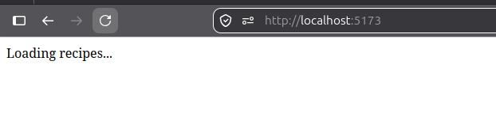
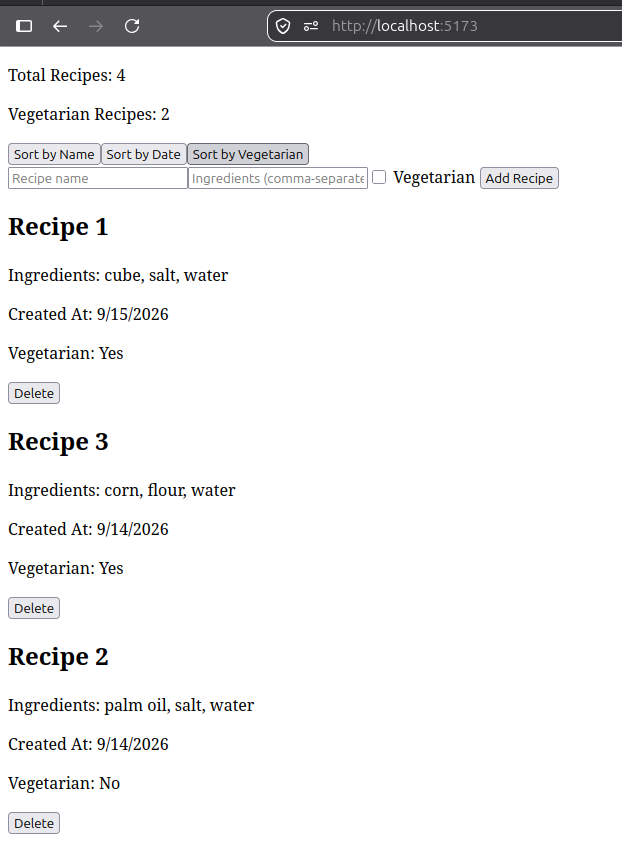
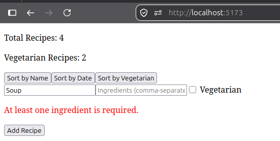

# Weekly Work Report

**Ticket:** TICKET - 02 - recipe - book - Recipe Management Application
**Type:** Training / Skill Development
**API Style:** Vue 3 Composition API

---

## Work Completed

- Defined a fully typed `Recipe` data model (`id`, `name`, `ingredients`, `isVegetarian`, optional `createdAt`), plus supporting types: `Status`, `SortBy`, `NewRecipe` (`Omit`), and a mock dataset (`mockRecipes` in `types.ts`).

- Implemented reactive core state (`status`, `recipes`, `sortBy`) and derived state (`sortedRecipes`, `vegetarianCount`, `totalCount`) using Composition API primitives (`ref`, `computed`).

- Implemented simulated asynchronous data loading via `onMounted`, with loading/success/error states in `useRecipes.ts`.

- Built four components per the ticket's required architecture:

- `StatsDisplay.vue` - presentational, displays total and vegetarian counts
- `RecipeItem.vue` - displays a single recipe, emits a `delete - recipe` event with the recipe's `id`
- `RecipeForm.vue` - controlled form with validation, emits an `add - recipe` event with a typed `NewRecipe` payload; ingredients are entered as a comma - separated string and converted to `string[]` on submit
- `RecipeList.vue` - renders the list and forwards `delete - recipe` events upward

- Integrated all components in a top - level container (`RecipeApp.vue`), wiring add/delete handlers and sort controls.

- Extracted all state and logic into a composable (`useRecipes.ts`), leaving the top - level component as orchestration only.

- Verified the application end - to - end in the browser: loading state, sorting by name/date/vegetarian status, adding a recipe, deleting a recipe, and reactive stat updates all confirmed working.

## How It Was Done

Implementation followed the agreed approach: types first, then reactive state prototype, then component split, then extraction into a composable. Each stage was manually validated in the browser. `vue - tsc  -  - noEmit` was run to confirm type - correctness for `.vue` files.

## Technical Decisions

- **`createdAt` as `number` (Unix timestamp via `Date.now()`)** - simplifies sorting and avoids `Date` serialization concerns.

- **`id` and `createdAt` generated by parent/composable on add** - `NewRecipe` excludes `id`; the composable assigns `id` and `createdAt` at creation time.

- **`RecipeItem.vue` accepts a single `Recipe` prop** for forward - compatibility with potential future fields.

- **`RecipeItem.vue` emits only the `id` on delete** - delete operations identify recipes by `id`.

- **Ingredients input**: the form collects a comma - separated string and converts it to `string[]` on submit.

## Difficulties / Blockers

- Declared type/interface/const values in types.ts without the export keyword, causing "declared locally but not exported" errors across every file that tried to import them.
- Wrote .sort() with an invalid {}-block syntax instead of passing a comparator function, and initially had no real sorting logic in any of the three sort branches.
- Used .sort() directly on recipes.value, which mutates the original array in place, rather than sorting a shallow copy ([...recipes.value]).
- Typo: recipe.isvegetarian (lowercase v) instead of recipe.isVegetarian, not matching the interface's actual property name.
- Wrote a mockRecipes[1] fetch-simulation using real HTTP-response patterns (response.ok, response.status, await response.json()) that don't apply to a plain mock object, including an invalid await inside a non-async function.
- Raised a false alarm on Prettier-formatted generic syntax (ref < Type > (...)) suspecting it was invalid — - verified via vue-tsc --noEmit that it was correctly parsed and typed; resolved with evidence rather than assumption.
- Forgot to add export to the useRecipes composable function, blocking its import into the top-level component.

## Evidence

- Screenshots: loading state, full working application (stats, sort controls, form, list), post - add state, post - delete state - to be attached by developer as local screenshots.
- 
- 
- 

## Acceptance Criteria Status

- Application displays a list of recipes - ✅ (see `RecipeList.vue`, `useRecipes.ts`)
- Users can add new recipes via a form - ✅ (see `RecipeForm.vue`, `handleAddRecipe` in `useRecipes.ts`)
- Users can delete recipes - ✅ (see `RecipeItem.vue` emit and `handleDeleteRecipe` in `useRecipes.ts`)
- Recipes can be sorted by multiple criteria - ✅ (sort by `name`, `createdAt`, `vegetarian` implemented in `useRecipes.ts`)
- Aggregate statistics are displayed and reactive - ✅ (`StatsDisplay.vue`, `vegetarianCount`, `totalCount`)
- TypeScript interfaces are correctly implemented - ✅ (`src/types/types.ts`, verified by `vue - tsc  -  - noEmit`)
- Reactive state is properly managed - ✅ (single source of truth in `useRecipes.ts`)
- Lifecycle hook is used for initial data loading - ✅ (`onMounted` in `useRecipes.ts`)
- Components are modular and reusable - ✅ (`RecipeList`, `RecipeItem`, `RecipeForm`, `StatsDisplay`)
- Composable pattern is used for shared logic - ✅ (`useRecipes.ts`)

## Definition of Done

- Application fully implemented and functional - ✅
- Code reviewed and follows Vue + TypeScript best practices - ⬜ Pending reviewer sign - off
- Components are reusable and well - structured - ✅
- State management and composables are validated - ✅
- No runtime or type errors - ✅ (verified by `vue - tsc  -  - noEmit`)
- Documentation or README added - ✅ (`README.md` in `recipe - book`)
- Ready for demo or onboarding reference use - ✅

## Next Step

Submit this report along with the `TICKET - 02 - recipe - book/recipe - book` folder for reviewer sign - off and code review. Screenshots and commit evidence are present locally - attach them to the review if required.

---

_This report was generated from the current state of the `TICKET - 02 - recipe - book/recipe - book` folder and reflects the implementation files present in the repository._
