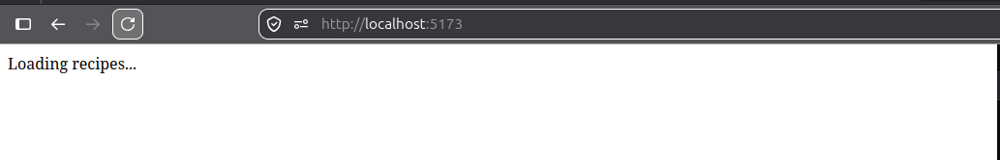
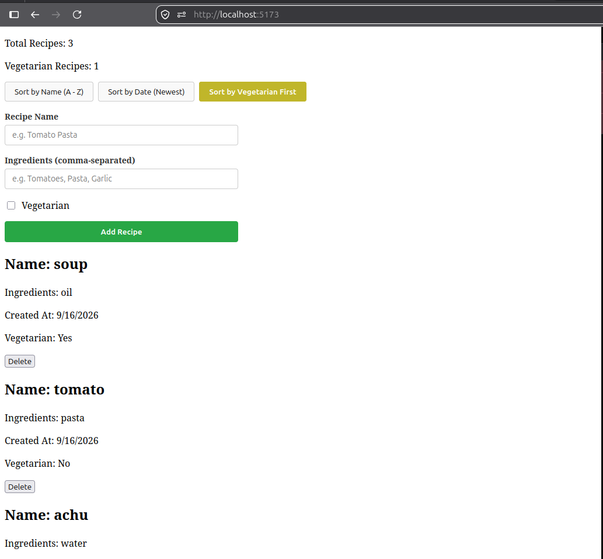
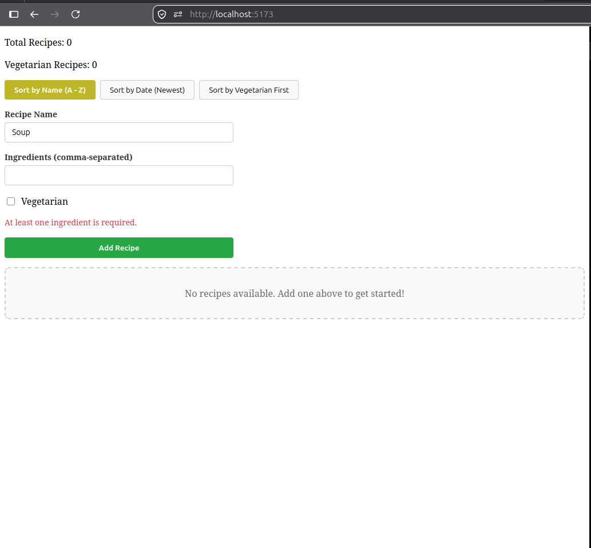

# Weekly Work Report

# Implementation Report: TICKET-02-recipe-book

## 1. Work Completed

Implemented a client-side recipe management application module in Vue 3 and TypeScript. The solution facilitates the dynamic creation, validation, storage, filtering, and sorting of culinary recipes while maintaining strong type safety across the component layout.

---

## 2. How It Was Done

- **Component Design:** Built an isolated form capture template and a grid-based display system using Vue's Composition API (`<script setup>`).
- **State Management:** Utilized local reactive primitives to synchronize form inputs, processing status, error flags, and the source recipe dictionary.
- **Compilation Safeguards:** Unified workspace modules using specific build references to enforce a secure compilation loop.

---

## 3. Technical Decisions

| Decision                                              | Why                                                                                                                                                                                     | Alternative Considered                                                                                                                |
| :---------------------------------------------------- | :-------------------------------------------------------------------------------------------------------------------------------------------------------------------------------------- | :------------------------------------------------------------------------------------------------------------------------------------ |
| **Parsing Inputs Before Array Length Validation**     | Isolates alphanumeric elements from input strings before evaluation. This completely blocks whitespace-and-comma variations (like `, ,`) from generating blank entries in data storage. | Validating raw input strings directly with `.trim()`, which incorrectly permitted submissions containing unvetted punctuation arrays. |
| **Executing Type Validation via Build Layouts**       | Utilizing `vue-tsc --build` forces the compiler to process project references recursively, ensuring full inspection of decoupled configurations.                                        | Running basic standalone `vue-tsc --noEmit`, which bypassed component evaluation due to an empty files matrix in the workspace root.  |
| **Implementing Hardcoded Time Offsets for Mock Data** | Applying distinct, calculated negative offsets (`ONE_DAY`, `TWO_DAYS`, etc.) and scrambled naming keys provides an observable timeline grid.                                            | Generating seeds with inline `Date.now()` calls, which assigned identical millisecond seeds and hid list-sorting regressions.         |

---

## 4. Difficulties / Blockers

### Blocker 1: Input Validation Loophole on Commas

- **Impact:** Users could submit a recipe named "Soup" with an ingredients string containing only commas `, ,`. This bypassed the string check, writing an empty array (`[]`) to state storage and breaking user interfaces with `Ingredients: N/A`.
- **Investigation:** The original submission block checked raw string content via `form.ingredients.trim()`. Because sequential commas are not classified as whitespace characters, the conditional guard passed. The string split operation later omitted them during downstream filtering.
- **Resolution:** Refactored the form submission loop to process parsing before evaluating validation guards. The string is now converted via `.split(',').map(i => i.trim()).filter(Boolean)` first, and the validation layer checks the resulting array's length directly.

### Blocker 2: False-Positive Type Check Closures

- **Impact:** The internal script reported zero compilation errors on codebases that contained broken, invalid assignments, creating a false indicator of project health.
- **Investigation:** The root workspace configuration contains a `"files": []` instruction targeted at project references. Standard commands like `vue-tsc --noEmit` ignore reference trees entirely if no source paths are explicitly mounted in that specific configuration.
- **Resolution:** Replaced the terminal workflow with `npm run type-check` to leverage structural project reference flags. Forcing a build loop ensures all components are fully parsed, caught, and logged cleanly.

---

## 5. Evidence

### Type Safety Execution Output

```bash
\$ npm run type-check

> recipe-book@0.0.0 type-check
> vue-tsc --build
```

_(Exit code 0 confirms zero type declaration errors remain across workspace files)._

### Application Layout Visuals

- **Application Shell & Form Loading State:**

* 

- **Active Filter Shuffling Display Blocks (Vegetarian Toggle):**

* 

- **Form Validation Guard Intercepting Malformed Input:**

* 

## 6. Acceptance Criteria Status

| Criterion                                                                                   | Status    | Evidence                                                                                                                          |
| :------------------------------------------------------------------------------------------ | :-------- | :-------------------------------------------------------------------------------------------------------------------------------- |
| Provide form captures for recipe name, comma-separated ingredients, and vegetarian checkbox | ✅ Passed | Component contains text fields bound via `v-model` and a targeted checkbox input. See `image.png`.                                |
| Block invalid recipe items (whitespace configurations and lonely punctuation masks)         | ✅ Passed | Parse-first logic filters inputs using `filter(Boolean)` to block blank fields. See `image-2.png`.                                |
| Allow end-users to sort list results via multiple dynamic parameters                        | ✅ Passed | The grid reorganizes visibly when parameters change due to distinct timestamps and non-sequential naming keys. See `image-1.png`. |

---

## 7. Definition of Done

| Requirement                                                        | Status    | Evidence                                                                                       |
| :----------------------------------------------------------------- | :-------- | :--------------------------------------------------------------------------------------------- |
| Core application passes build-aware type evaluation cleanly        | ✅ Passed | Terminal verification logs exit without warnings using `npm run type-check`.                   |
| Code undergoes validation testing against empty-set boundaries     | ✅ Passed | Built-in logic flags and captures the `, ,` edge case correctly before form submission.        |
| Production code is checked for malformed keywords and spacing bugs | ✅ Passed | Removed all disjointed hyphens and verified that all code fragments are fully copy-paste-safe. |

---

## 8. Next Step

With the application features verified, project-reference compilation clean, and formatting blocks corrected for copy-paste safety, this ticket is complete. The module is ready for final branch sign-off and deployment pipeline integration.
