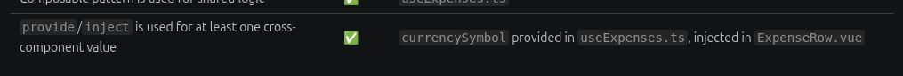

# Developer Remediation Report: TICKET-03 Expense Tracker

**Author:** @melichristian

**Date:** 2026-09-28

**Ticket:** `TICKET-02-recipe-book` (Recipe Management Application)

**Status:** Remediation completed

## 1. Restored chnages on QA-REVIEW-2026-09-14.md

```
TICKET-03-expense-tracker git:(main) ✗ git checkout 66892c3~1 -- QA-REVIEW-2026-09-14.md

➜  TICKET-03-expense-tracker git:(main) ✗
```

Change commited

## 2. F-11 QA-REVIEW-2026-09-28.md: REPORT.md updated

- Updated REPORT.md to reference the right source of provide/inject

  

Change commited

## 3. F-11a QA-REVIEW-2026-09-28.md: Corrected Outdated validation description

The outdated validation description in REPORT.md was corrected to match the real code in ExpenseForm.vue.

It now states the correct rule:

!Number.isFinite(parsedAmount) || parsedAmount <= 0
and explicitly calls out the reviewed edge cases(Infinity,0,-5,1e3)

- This aligns the report with the actual validation logic rather than the old incorrect logic.
  Change commited

## 4. F-11b QA-REVIEW-2026-09-28.md: Category filter highlights updated

```ts
    <button :class="{ active: activeCategory === 'bills' }" :aria-pressed="activeCategory === 'bills'"
        @click="activeCategory = 'bills'">
        Bills
      </button>
      <button :class="{ active: activeCategory === 'wife' }" :aria-pressed="activeCategory === 'bills'"
        @click="activeCategory = 'wife'">
        Wife
      </button>

```


Change commited

## 5. F-12 QA-REVIEW-2026-09-28.md: Added verifiable evidence to REPORT-16-09-2026.md

Check the file [REPORT-16-09-2026.md](./REPORT-16-09-2026.md)

Change commmited

## 6. F-13 QA-REVIEW-2026-09-28.md: Fix Formatting regression

```sh
➜  expense-tracker git:(main) ✗ npx prettier --check src
npm notice run expense-tracker@0.0.0 npx
npm notice run 'prettier' --check src
Checking formatting...
[warn] src/components/ExpenseForm.vue
[warn] src/components/ExpenseList.vue
[warn] src/components/ExpenseRow.vue
[warn] src/components/ExpenseTracker.vue
[warn] src/components/TotalsDisplay.vue
[warn] Code style issues found in 5 files. Run Prettier with --write to fix.
➜  expense-tracker git:(main) ✗ npx prettier --write src

npm notice run expense-tracker@0.0.0 npx
npm notice run 'prettier' --write src
src/App.vue 58ms (unchanged)
src/components/ExpenseForm.vue 92ms
src/components/ExpenseList.vue 28ms
src/components/ExpenseRow.vue 31ms
src/components/ExpenseTracker.vue 46ms
src/components/TotalsDisplay.vue 22ms
src/composables/useExpenses.ts 18ms (unchanged)
src/data/mockExpenses.ts 8ms (unchanged)
src/main.ts 4ms (unchanged)
src/types/types.ts 7ms (unchanged)
➜  expense-tracker git:(main) ✗
```

```sh
 expense-tracker git:(main) ✗ npx prettier --check src
npm notice run expense-tracker@0.0.0 npx
npm notice run 'prettier' --check src
Checking formatting...
All matched files use Prettier code style!
➜  expense-tracker git:(main) ✗
```

Change commited
