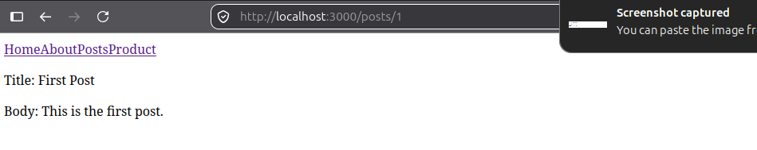
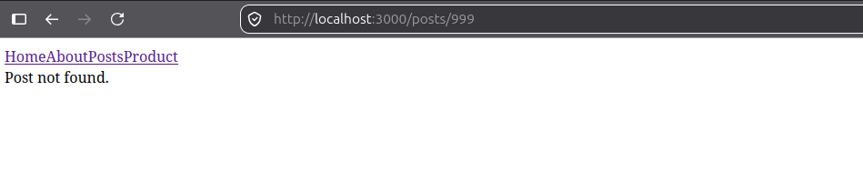
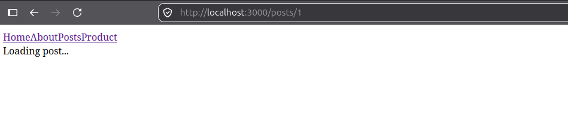

# Weekly Work Report

**Ticket:** TICKET-04-nuxt-fundamentals — Nuxt 4 Fundamentals
**Type:** Training / Skill Development

---

## Work Completed

- Scaffolded a Nuxt 4 project (confirmed version 4.5.2, after identifying that Nuxt 3 is end-of-life)
- Built static pages (`/index`, `/about`), a nested index page (`/posts/indxe`), and a dynamic route (`/posts/[id]`)
- Implemented client-side navigation using `<NuxtLink>` and confirmed route rendering via `<NuxtPage />`
- Implemented two layouts (`default.vue` with navigation, `minimal.vue` without), and applied the alternate layout to a specific page using `definePageMeta`
- Built two Nuxt server API routes (`server/api/posts/index.ts`, `server/api/posts/[id].ts`) as a mock backend, including dynamic parameter resolution (`getRouterParam`)
- Fetched data on both the list and detail pages using `useFetch`, with explicit loading and error states in each
- Verified both the success path (valid post ids) and the error path (`/posts/999`, a nonexistent id) in the browser

## How It Was Done

Followed a build-and-verify-immediately approach: each Nuxt concept (routing, then layouts, then data fetching) was implemented incrementally and manually tested in the browser before moving to the next. Server routes were built to mirror the frontend's dynamic route structure, keeping the mock API shape close to what a real backend endpoint would return.

## Technical Decisions

**Decision:** Switched from the originally planned Nuxt 3 to Nuxt 4.
**Why:** Nuxt 3 reached end-of-life on July 31, 2026 and no longer receives security patches; Nuxt 4 is the current actively maintained version and the one a real client project would use.
**Alternative considered:** Proceeding with Nuxt 3 as originally planned — rejected, since building fundamentals on a deprecated version would need to be redone before real client work.

**Decision:** Used `useFetch` (not `useAsyncData` or `$fetch`) for both the post list and individual post pages.
**Why:** `useFetch` is the standard choice for loading data at page-load time, with automatic SSR/client sync and built-in `status`/`error` handling — appropriate for this use case. `useAsyncData` was not needed since no custom fetch logic or multi-source combination was required at this stage.

**Decision:** Mock post data is centralized.
**Why:** Reflect real life work and best practices.

## Difficulties / Blockers

**Problem:** Adding `lang="ts"` to a `<script setup>` block using `definePageMeta` produced a "Cannot find name 'definePageMeta'" error.
**Impact:** Blocked re-enabling TypeScript type-checking on that file.
**Investigation:** Identified that Nuxt auto-imports macros like `definePageMeta` at runtime via a generated `.nuxt` folder, and that the editor's TypeScript language server needs those generated types available to recognize the macro — the dev server running alone doesn't guarantee the editor has picked them up.
**Resolution / Current status:** Resolved by running `npx nuxi prepare` to regenerate the `.nuxt` type declarations, then restarting the editor's TypeScript server.

**Problem:** Initial `[id].vue` page implementation used a mismatched API endpoint (`/api/post/` singular instead of `/api/posts/` plural), incorrect property names (`posts.Id`, `posts.description` instead of `post.title`, `post.body`), and omitted loading/error state handling entirely.
**Impact:** The individual post page would not have correctly displayed data, and critically, would not have handled the not-found case at all — meaning a broken or blank page for any invalid post id, with no graceful error message.
**Investigation:** Compared the implementation line-by-line against the originally specified page and server route, checking the fetch URL, destructured property names, and presence of `status`/`error` template branches.
**Resolution / Current status:** Resolved by correcting the endpoint URL, property names, and reinstating explicit `status`/`error` template handling. Both the success path (`/posts/1`) and the error path (`/posts/999`) were then explicitly tested and confirmed working, rather than assumed correct from the code alone.

## Evidence

- Local Nuxt 4 project (`nuxt-fundamentals`), version confirmed via `package.json`
- Manually verified: static routes, nested route, dynamic route, both layouts, both fetch states (loading/success) and both outcome states (found/not-found) on the post detail page
- Screenshots:
  
  
  
  
  

## Acceptance Criteria Status

| Acceptance Criteria                              | Status | Evidence                                             |
| ------------------------------------------------ | ------ | ---------------------------------------------------- |
| Static routes render correctly                   | ✅     | Manually verified `/`, `/about`                      |
| Nested route renders correctly                   | ✅     | Manually verified `/posts`                           |
| Dynamic route reads and displays route parameter | ✅     | Manually verified `/posts/[id]`                      |
| Client-side navigation works without full reload | ✅     | `<NuxtLink>` confirmed                               |
| Default layout displays shared navigation        | ✅     | `layouts/default.vue`                                |
| Alternate layout applies via `definePageMeta`    | ✅     | `layouts/minimal.vue` on `/about`                    |
| Post list fetches and displays real data         | ✅     | `useFetch('/api/posts')`                             |
| Individual post fetches and displays real data   | ✅     | `useFetch('/api/posts/:id')`, corrected and verified |
| Loading state shown while data in flight         | ✅     | `status === 'pending'` branch                        |
| Error/not-found state shown for invalid id       | ✅     | Explicitly tested via `/posts/999`                   |

## Definition of Done

| Requirement                                    | Status                       |
| ---------------------------------------------- | ---------------------------- |
| Implementation completed and manually tested   | ✅                           |
| Both success and error paths explicitly tested | ✅                           |
| No console errors                              | ✅                           |
| Code committed with descriptive messages       | ✅                           |
| Evidence captured (screenshots)                | ✅                           |
| Technical difficulties documented              | ✅                           |
| Code review completed                          | ⬜ Pending reviewer sign-off |
| QA validated                                   | ⬜ Pending                   |

## Next Step

**Next action:** Capture evidence screenshots, commit work with descriptive messages, and submit this ticket for reviewer sign-off. Follow up with a dedicated session on SSR/SSG concepts (deferred from this ticket's scope).
**Expected outcome:** Reviewer validates routing/layout/fetching implementation; SSR/SSG covered in the next session as a continuation of Nuxt fundamentals.
