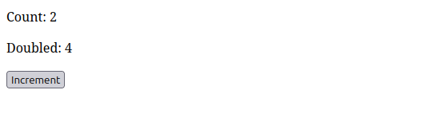
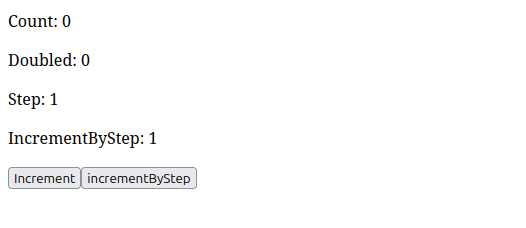
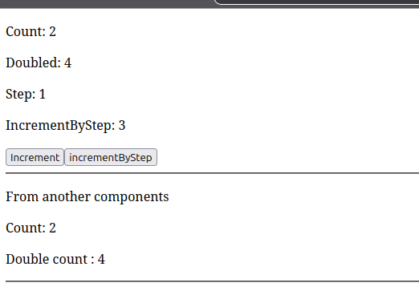
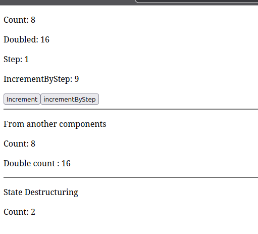
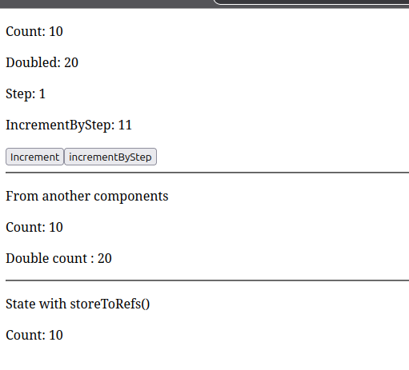
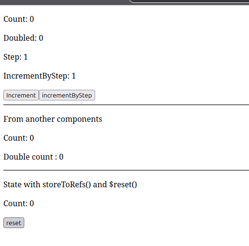

# Weekly Work Report

**Ticket:** TICKET-06-pinia-state-management — Pinia State Management
**Project:** `nuxt-with-pinia`
**Type:** Training / Skill Development

---

## Work Completed

- Scaffolded a new, dedicated Nuxt 4 project (`nuxt-with-pinia`), separate from `nuxt-fundamentals`
- Installed and configured Pinia (`pinia`, `@pinia/nuxt`), registering the module in `nuxt.config.ts`
- Confirmed store auto-import from `stores/` (no manual import required)
- **Step 2 — First store:** built `stores/counter.ts` with `state` (`count`), a `getter` (`doubleCount`), and an `action` (`increment`); consumed in `app/pages/index.vue`; manually confirmed `count` and `doubleCount` update together on click
- **Step 3 — Extended store:** added `step` state, a `projectedCount` getter depending on two state properties (`count + step`), a parameterized action `incrementBy(amount: number)`, and an action `incrementByStep()` that calls `incrementBy` internally via `this` — confirmed working correctly in the browser
- **Step 4 — Cross-component reactivity:** created `CounterDisplay.vue`, a purely presentational component independently consuming the same `useCounterStore()`; confirmed it updates live when state changes from `index.vue`, with no props or emits involved
- **Step 5 — `storeToRefs`:** deliberately destructured store state directly first (`const { count } = useCounterStore()`) and confirmed the reactivity failure (the value did not update on state change); then corrected it using `storeToRefs()` and confirmed reactivity was restored
- **Step 6 — Reset:** implemented and confirmed Pinia's built-in `$reset()`, restoring `count`, `step`, and derived getters to their initial values after being changed
- **Step 7 — Second independent store:** built `stores/theme.ts` with `state` (`isDark`), a `themeLabel` getter deriving a human-readable `"Dark"`/`"Light"` label (corrected after initial review — the first version returned the raw boolean instead of deriving a label), and a `toggleTheme` action; confirmed it operates independently of the counter store with no interference

## How It Was Done

Followed the approach document's gradual, step-by-step sequence, verifying each concept in the browser before extending to the next: basic store mechanics → richer state/getters/actions → cross-component sharing (Pinia's core value proposition) → the `storeToRefs` pitfall (deliberately observed as broken before being fixed, not just implemented correctly from the start) → reset → a second, fully independent store to confirm multiple stores can coexist cleanly.

## Technical Decisions

**Decision:** Used an options-style store (`state`/`getters`/`actions` object) throughout, rather than setup-style.
**Why:** Options-style maps directly onto concepts already learned — `state` as data, `getters` as computed-like derived values, `actions` as methods — making the Pinia mental model faster to acquire. Setup-style stores remain deferred to a later ticket, per the approach document's stated open point.

**Decision:** Step 5 (`storeToRefs`) was deliberately implemented in two passes — first the broken (plain-destructure) version, confirmed to actually fail, then the corrected version — rather than only implementing the correct version.
**Why:** The value of this exercise is recognizing _why_ `storeToRefs` is necessary, not just knowing the correct syntax. Skipping the broken version would have risked memorizing a pattern without understanding the reactivity pitfall it solves.

**Decision:** `themeLabel` was corrected during review to derive a string label (`'Dark' | 'Light'`) instead of returning the raw `isDark` boolean.
**Why:** A getter that simply returns a state property unchanged adds no value over accessing the state directly; the exercise's intent was to demonstrate genuine derivation, consistent with how `doubleCount` and `projectedCount` derive new values from state rather than aliasing it.

## Difficulties / Blockers

**Problem:** Initial `themeLabel` getter returned `state.isDark` directly instead of deriving a `'Dark'`/`'Light'` string.
**Impact:** The getter provided no actual transformation of state, functionally identical to accessing `isDark` directly — missing the point of the exercise.
**Resolution / Current status:** Resolved by updating the getter to `(state) => (state.isDark ? 'Dark' : 'Light')`.

No other blockers encountered — installation, module registration, and each subsequent step worked as expected once implemented correctly.

## Evidence

Local project: `nuxt-with-pinia`

- All seven steps manually verified in-browser, including the deliberately-broken `storeToRefs` case (confirmed to fail before the fix was applied)
- Commit: work committed with descriptive messages, covering steps 3 through 7
- Screenshots: attached, covering basic store, cross-component reactivity, storeToRefs before/after, reset behavior, and the theme store
- First store
  
- Extended Store
  
- Same Store accros multiple components
  
- Destructuring
  
- State with storeToRefs()
  
- State $reset()
  

## Acceptance Criteria Status

| Acceptance Criteria                                                       | Status | Evidence                                           |
| ------------------------------------------------------------------------- | ------ | -------------------------------------------------- |
| Pinia and `@pinia/nuxt` correctly installed and configured                | ✅     | `nuxt.config.ts`                                   |
| Store defined with `state`, multiple `getters`, multiple `actions`        | ✅     | `stores/counter.ts`                                |
| Store consumed in at least two components with cross-component reactivity | ✅     | `index.vue` + `CounterDisplay.vue`                 |
| `storeToRefs` correctly demonstrated (break, then fix)                    | ✅     | Broken version confirmed to fail before correction |
| Reset-to-initial-state mechanism implemented                              | ✅     | `$reset()` confirmed working                       |
| No TypeScript errors                                                      | ✅     | No errors observed across all steps                |

## Definition of Done

| Requirement                                                         | Status |
| ------------------------------------------------------------------- | ------ |
| Implementation completed and manually tested for every core feature | ✅     |
| Code compiles with zero TypeScript errors                           | ✅     |
| Evidence captured (screenshots)                                     | ✅     |
| Technical decisions and difficulties documented                     | ✅     |
| Code committed with descriptive messages                            | ✅     |

## Next Step

**Next action:** Submit this ticket (TICKET.md, APPROACH.md, REPORT.md, code, and evidence) for reviewer sign-off.
**Expected outcome:** Reviewer validates the full Pinia fundamentals implementation; ticket closed and used as a reference for applying Pinia to a real feature in a future ticket.
