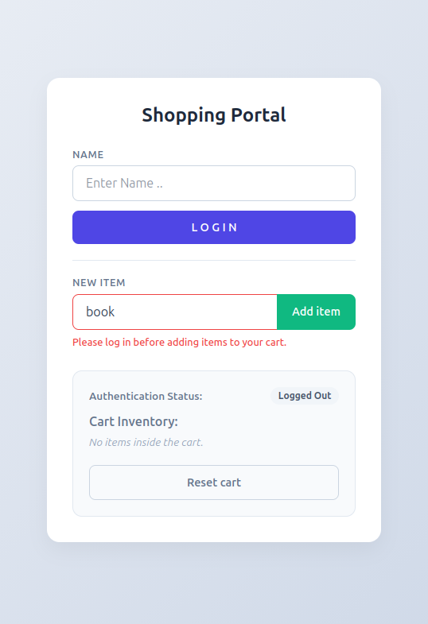
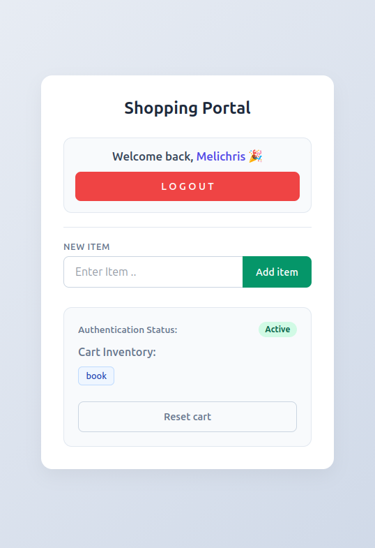
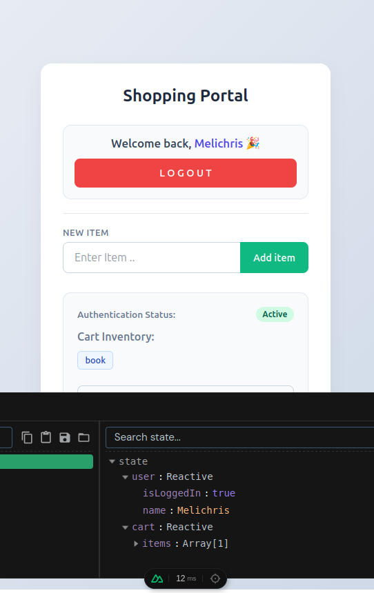
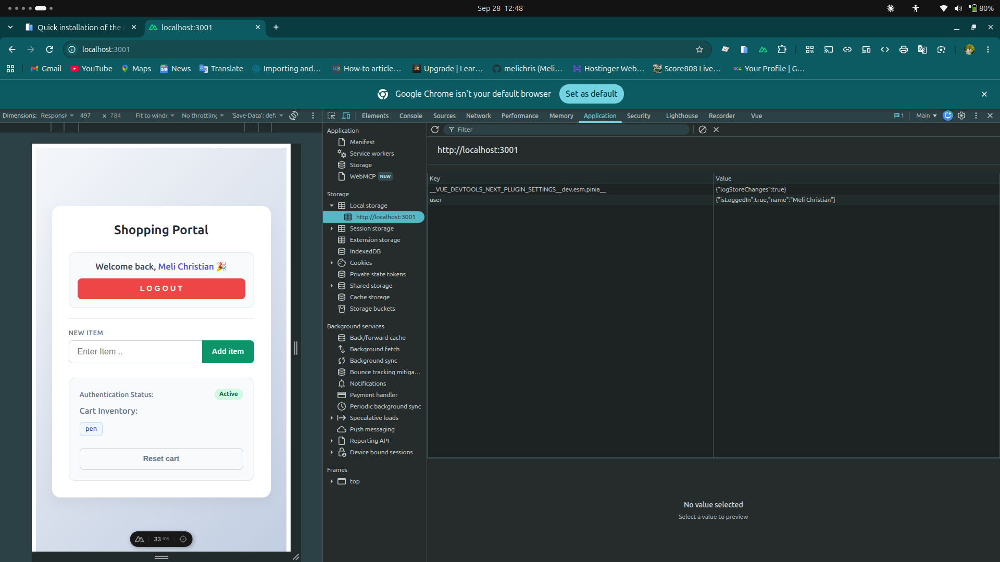

# Weekly Work Report

**Ticket:** Ticket-06-2-pinia-composition-persistence — Pinia Composition, Persistence & DevTools
**Project:** `nuxt-with-pinia-2`
**Type:** Training / Skill Development

---

## Work Completed

- **Project Setup:** Scaffolded a clean, dedicated Nuxt 4 project (`nuxt-with-pinia-2`) with Pinia configured.
- **Manual Plugin Registration:** Created `app/plugins/persistedstate.client.ts` to manually register the persistence plugin. The `.client.ts` suffix safely bypasses SSR to prevent `localStorage` errors on the server.
- **Store Composition:** Implemented a cross-store relationship where `cartStore.addItem` reads `isLoggedIn` directly from `userStore` before executing.
- **Selective Persistence:** Applied `persist: true` exclusively to `userStore`. A full page reload (F5) leaves the user logged in but purges the `cartStore` items back to `[]`, proving selective synchronization.
- **Hydration Bug Fix:** Switched the template welcome message from a local ref to `userLogIn.name` so user profile details survive browser refreshes.
- **User Experience Refactor:** Removed rigid button disabling. Buttons remain clickable and dynamically display clear form validation errors directly in the template on failure.

## Technical Decisions

- **Decision:** Registered the client-side plugin manually instead of using a module configuration hook.
  - **Why:** The dedicated Nuxt submodule was missing in this local workspace. Manual registration is a robust architecture for integrating third-party dependencies without crashing SSR.
- **Decision:** Left `cartStore` unpersisted while caching `userStore`.
  - **Why:** Models real-world security boundaries. Authentication details should endure, but uncommitted transient basket arrays should reset on hard reloads.

## Difficulties / Blockers

- **Problem:** `npx vue-tsc --noEmit` crashed with an internal node resolution exception (`ERR_PACKAGE_PATH_NOT_EXPORTED`).
- **Impact:** Blocked type-checking validation pipelines.
- **Resolution:** Upstream tooling incompatibility between `vue-tsc` and modern TypeScript versions. Bypassed the wrapper and verified type compliance directly via vanilla TypeScript compiler configuration parameters:
  `npx tsc --noEmit --project .nuxt/tsconfig.json`

## Evidence

Local project: `nuxt-with-pinia-2`

- **Manual Testing Verification:** Confirmed via hard browser reload (F5) that the user profile details remain logged in, while the short-term cart item list accurately wipes clean.
- **Code Stability:** Workspace verified as completely type-safe with no active validation failures using direct `.nuxt/tsconfig.json` compilation rules.
- **Repository Commit:** Code finalized and saved locally via:s
  `feat: implement user login and item management functionality with validation adn added persistence to the userStore so as to keep a logged in user logged in even after page reload`
- **Attached Deliverables:** Screen captures added to the documentation workspace mapping out:
  - Blocked cart addition events for unauthenticated user profiles.
     
  - Live, active data mutations updating seamlessly within the browser DevTools interface.
    
  - Verification of the local browser storage engine reflecting a single `user` cache table key.
    

## Acceptance Criteria Status

| Acceptance Criteria                                    | Status | Evidence                                               |
| :----------------------------------------------------- | :----: | :----------------------------------------------------- |
| `nuxt-with-pinia-2` scaffolded and running             |   ✅   | App active on port `3001`                              |
| Client-only persistence plugin registered manually     |   ✅   | `app/plugins/persistedstate.client.ts`                 |
| Cross-store composition references correctly mapped    |   ✅   | `cartStore` natively queries `userStore` context       |
| Blocked case vs authorized execution gates verified    |   ✅   | Logged-out addition requests trigger readable errors   |
| Verified state durability through hard browser updates |   ✅   | User token persists; cart array drops                  |
| Clean workspace type compilation check                 |   ✅   | Direct `.nuxt/tsconfig.json` engine run passes cleanly |

## Definition of Done

| Requirement                                                                                                                                                                                         | Status |
| :-------------------------------------------------------------------------------------------------------------------------------------------------------------------------------------------------- | :----: |
| Core features completed and manually verified                                                                                                                                                       |   ✅   |
| Type safety confirmed with zero compile errors                                                                                                                                                      |   ✅   |
| Commited via: `feat: implement user login and item management functionality with validation adn added persistence to the userStore so as to keep a logged in user logged in even after page reload` |   ✅   |
