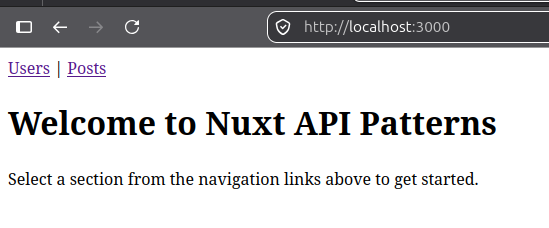
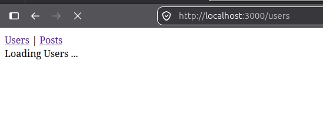
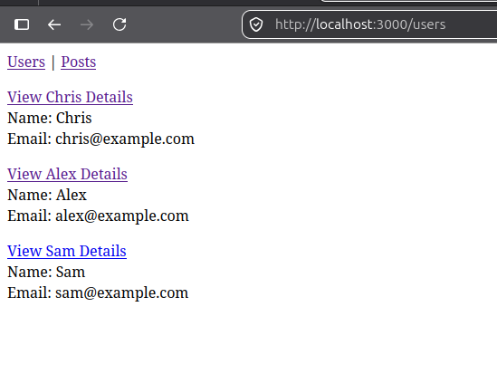
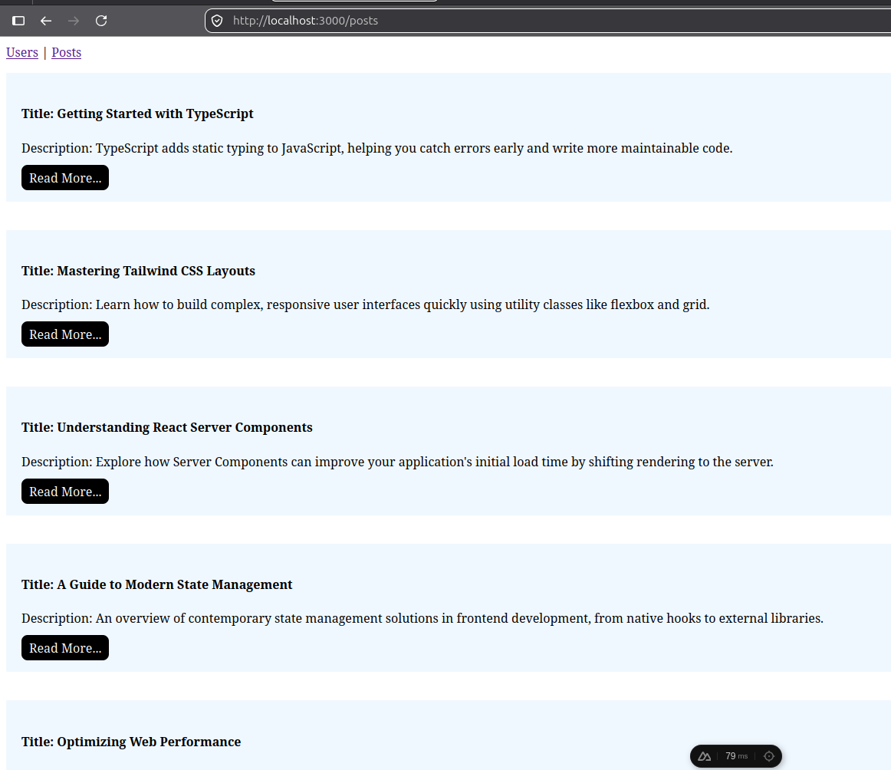
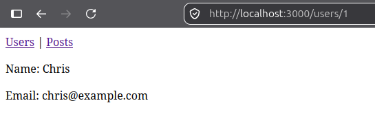
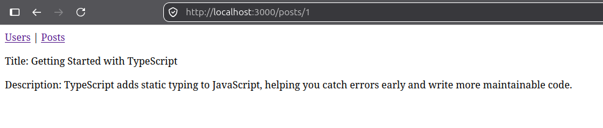
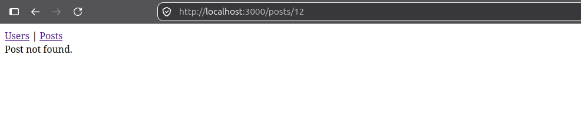
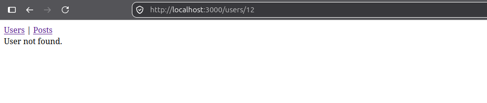

# Weekly Work Report

**Ticket:** Ticket-06-3-api-integration-patterns — API Integration Patterns
**Project:** `nuxt-api-patterns`
**Type:** Training / Skill Development

---

## Work Completed

- Scaffolded a Nuxt 4 project for API integration and typed data access patterns.
- Added shared response contracts in `app/types/api.ts` for `User`, `Post`, `Status`, and `ApiResponse`.
- Created mock backend data in `server/data/users.ts` and `server/data/posts.ts`.
- Added list and detail mock routes under `server/api/users/` and `server/api/posts/`.
- Implemented a reusable typed `$fetch` wrapper in `app/composables/useApi.ts`.
- Added Pinia stores for list data access in `app/stores/usersStore.ts` and `app/stores/postsStore.ts`.
- Built list pages for users and posts, plus detail pages for individual user/post records.
- Added app navigation in `app/app.vue`.
- Verified 404 handling for missing ids, with explicit error messages rather than unhandled exceptions.
- Confirmed the project builds and type-checks successfully with `npm run build` and `npx nuxi typecheck`.

## How It Was Done

The work was structured in the expected sequence:

1. Create the shared data contract.
2. Create centralized mock data.
3. Add mock server routes for list and detail responses.
4. Build a typed API wrapper around `$fetch`.
5. Add Pinia stores for async data loading.
6. Build page-level UI for loading, success, and error states.
7. Validate with build and type-check commands.

## Technical Decisions

- **Decision:** Use `$fetch` inside the reusable wrapper instead of `useFetch`.
  - **Why:** `useFetch` is meant for a component/composable setup context, while Pinia store actions are plain async logic. `$fetch` works safely from a store action and typed utility layer.

- **Decision:** Keep the mock API local to the Nuxt server instead of introducing `runtimeConfig`.
  - **Why:** The app is using its own local server routes, so a relative path is the simplest and most appropriate approach for this training task.

- **Decision:** Centralize mock data in `server/data/` files.
  - **Why:** This avoids duplicating the same arrays across multiple server routes and keeps the data source consistent.

- **Decision:** Return `{ data, error }` from the API wrapper rather than throwing directly from every call.
  - **Why:** This makes success and failure handling explicit and consistent across both stores and page logic.

## Difficulties / Blockers

- **Problem:** The first implementation of the wrapper risked recursion by calling the wrapper itself instead of `$fetch`.
  - **Resolution:** Replaced the recursive call with a single `$fetch(url)` invocation.

- **Problem:** A wrong property name in the `User` type (`emmail`) caused a mismatch.
  - **Resolution:** Corrected the interface before the app depended on the wrong field name.

- **Problem:** `onMounted(store.fetchUsers())` executed immediately instead of passing a callback.
  - **Resolution:** Changed it to `onMounted(() => store.fetchUsers())`.

- **Problem:** Invalid template binding syntax or incorrect conditional usage on the page templates.
  - **Resolution:** Replaced invalid object literal usage with a template literal and used `v-else` correctly for the final branch.

- **Problem:** Pinia configuration used `action` instead of `actions`.
  - **Resolution:** Corrected the store definition so the async actions were actually registered and used.

- **Problem:** Store initial state values were typed incorrectly at runtime.
  - **Resolution:** Set initial values to actual runtime values such as `"loading" as Status` and `null as User[] | null`.

## Reality Check Against the Original Report

The following statement in the original report was too strong: “Components consume store state and actions only.”

In the real implementation:

- The list pages use Pinia stores.
- The detail pages do not use the stores; they call `useApi` directly inside the page setup.

This is a valid pattern for a training exercise, but it means the app is not fully consistent with a strict “store-only consumption” architecture. The project demonstrates a mixed pattern rather than an all-store solution.

## Evidence

Verified commands:

- `nuxt-api-patterns git:(main) ✗  npm run build && npx nuxi typecheck`

Actual result:

- Build completed successfully
- Type check passed successfully

Observed behavior:

- User list loads successfully
- Post list loads successfully
- `/users/999` shows a friendly error state
- `/posts/999` shows a friendly error state
- No unhandled crash was observed from the missing-resource route

- **Screenshots and evidence of work:**
  
  - Users list page loading successful data
    
  - Posts list page loading successful data
    
  - User detail page with typed data rendered
    
  - Post detail page with typed data rendered
    
  - Error state for a missing user/post id
    
    

## Acceptance Criteria Status

| Acceptance Criteria                                |   Status   | Evidence                                                      |
| :------------------------------------------------- | :--------: | :------------------------------------------------------------ |
| Reusable typed API wrapper using `$fetch` exists   |     ✅     | `app/composables/useApi.ts`                                   |
| At least two response types are defined and reused |     ✅     | `User`, `Post`, `Status`, `ApiResponse` in `app/types/api.ts` |
| At least two mock server routes return data        |     ✅     | `/api/users`, `/api/posts`, and detail routes                 |
| Pinia store contains async fetch actions           |     ✅     | `usersStore.ts`, `postsStore.ts`                              |
| Store manages loading/success/error state          |     ✅     | Store `status` values                                         |
| Components consume store state and actions only    | ⚠️ Partial | List pages do; detail pages call `useApi` directly            |
| Deliberate error path is handled gracefully        |     ✅     | 404 route handling for missing user/post ids                  |
| Project builds and type-checks successfully        |     ✅     | Verified with build and `nuxi typecheck`                      |

## Definition of Done

| Requirement                                        | Status |
| :------------------------------------------------- | :----: |
| API integration pattern implemented                |   ✅   |
| Shared typed API contract defined                  |   ✅   |
| Mock backend created for list and detail endpoints |   ✅   |
| Pinia stores manage async fetch logic              |   ✅   |
| Loading and error states handled in UI             |   ✅   |
| Final build and strict type check validated        |   ✅   |
| Report aligned with the actual implementation      |   ✅   |

## Next Step

**Next action:** Keep the project as-is, and if the goal is to make the solution fully store-driven, refactor the detail pages to consume Pinia store state instead of calling `useApi` directly.
**Expected outcome:** The implementation matches the ideal architecture more closely and the training objective is reinforced with a stricter store-centric pattern.
