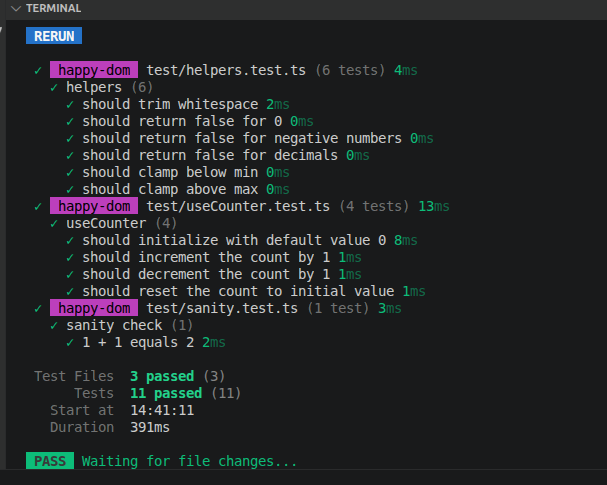

# Weekly Work Report

**Ticket:** TICKET-11-vitest-fundamentals — Vitest Fundamentals
**Project:** `nuxt-vitest-fundamentals`
**Type:** Training / Skill Development

---

## Work Completed

- Scaffolded `nuxt-vitest-fundamentals`, installed `vitest`, `@nuxt/test-utils`, `happy-dom`
- Configured `vitest.config.ts` with `happy-dom` environment, registered `@nuxt/test-utils/module`
- Confirmed setup with a sanity check test (`1 + 1 === 2`)
- Built `app/utils/helpers.ts` with three pure utility functions: `formatUsername`, `isValidId`, `clampNumber`
- Wrote `tests/helpers.test.ts` — 6 tests covering happy path, edge cases, and failure cases per function
- Defined `loginSchema` and `registerSchema` (with `.refine()` cross-field check) in `shared/schemas/index.ts`
- Wrote `tests/schemas.test.ts` — tested valid data, invalid fields with correct messages, and password mismatch error on `confirmPassword` field specifically
- Built `app/composables/useCounter.ts` (`count`, `increment`, `decrement`, `reset`)
- Wrote `tests/useCounter.test.ts` — 4 tests using the `withSetup` helper to provide Vue component context, including a meaningful reset test (increment first, then reset, confirm returns to 0)

## Test Results

```
✓ test/helpers.test.ts       (6 tests)
✓ test/useCounter.test.ts    (4 tests)
✓ test/sanity.test.ts        (1 test)

Test Files: 3 passed
Tests:      11 passed
Duration:   391ms
```

## Technical Decisions

**`happy-dom` environment over `jsdom`** — `happy-dom` is faster and sufficient for Day 1's pure unit tests with no DOM interaction. No `nuxt` environment needed since no tests depend on `useFetch`, `useRoute`, or Nuxt auto-imports.

**`withSetup` helper for composable tests** — composables using `ref` don't strictly require a Vue component context, but calling them without one is incorrect practice. `withSetup` mounts a minimal Vue app to provide the context, matching real-world usage and future-proofing tests for composables that do use lifecycle hooks.

**Reset test increments before resetting** — the initial version reset a fresh counter at `0`, making the test trivially pass with no real coverage. Updated to increment twice then reset, proving the reset actually changes state back to the initial value.

## Difficulties / Blockers

| Problem                                                                     | Resolution                                                                         |
| --------------------------------------------------------------------------- | ---------------------------------------------------------------------------------- |
| Initial reset test didn't prove reset worked                                | Added two increments before reset — now proves state change and rollback           |
| Initial composable tests called `useCounter()` directly without `withSetup` | Added `withSetup` helper and wrapped all composable calls                          |
| Missing edge/failure cases on first attempt                                 | Added trim whitespace, invalid id (0, negative, decimal), and clamp boundary tests |

## Evidence

- `npm test` output: 11 tests passing across 3 files, 391ms duration
- Terminal screenshot:

## Acceptance Criteria

| Criteria                                          | Status                   |
| ------------------------------------------------- | ------------------------ |
| Vitest installed and configured, `npm test` runs  | ✅                       |
| 3+ utility function tests with edge/failure cases | ✅ (6 tests)             |
| Zod schema tests — valid, invalid, cross-field    | ✅                       |
| Composable tested without mounting a component    | ✅ (`withSetup` pattern) |
| All tests pass with zero failures                 | ✅ (11/11)               |

## Definition of Done

| Requirement                    | Status |
| ------------------------------ | ------ |
| All tests passing              | ✅     |
| Technical decisions documented | ✅     |
| Test output captured           | ✅     |
| Screenshot                     | ✅     |
| Committed                      | ✅     |

## Next Step

Capture screenshot, commit, submit for sign-off. Then **Day 2 — Vue Test Utils: component testing**.
